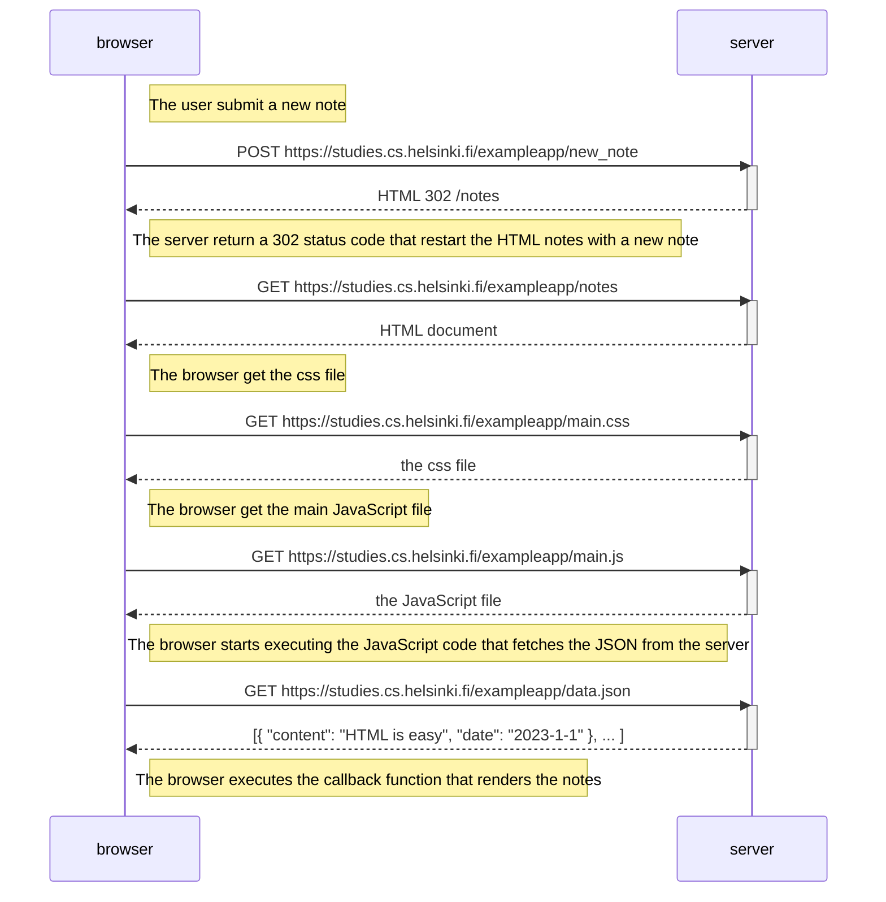

```mermaid
sequenceDiagram
  participant browser
  participant server

  Note right of browser: The user submit a new note
  
  browser->>server: POST https://studies.cs.helsinki.fi/exampleapp/new_note
  activate server
  server-->>browser: HTML 302 /notes
  deactivate server

  Note right of browser: The server return a 302 status code that restart the HTML notes with a new note

  browser->>server: GET https://studies.cs.helsinki.fi/exampleapp/notes
  activate server
  server-->>browser: HTML document
  deactivate server

  Note right of browser: The browser get the css file

  browser->>server: GET https://studies.cs.helsinki.fi/exampleapp/main.css
  activate server
  server-->>browser: the css file
  deactivate server

  Note right of browser: The browser get the main JavaScript file

  browser->>server: GET https://studies.cs.helsinki.fi/exampleapp/main.js
  activate server
  server-->>browser: the JavaScript file
  deactivate server
  
  Note right of browser: The browser starts executing the JavaScript code that fetches the JSON from the server
  
  browser->>server: GET https://studies.cs.helsinki.fi/exampleapp/data.json
  activate server
  server-->>browser: [{ "content": "HTML is easy", "date": "2023-1-1" }, ... ]
  deactivate server
  
  Note right of browser: The browser executes the callback function that renders the notes
```
